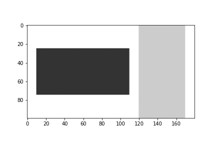

# ImageArranger
```
pip install git+https://github.com/naru-19/ImageArranger
```

# usage

## digital number
```python
import imgarr.digital_number as digitn
import matplotlib.pyplot as plt

plt.imshow(digitn.num2img(n=15, size=(70, 50), fix_digit=3))
plt.axis("off")
plt.savefig("../imgs/demo_digit.png")

```


## interactive_show

To display PIL images interactively.
```python
# test_ishow.ipynb
import imgarr.interactive_plot as iplt
import matplotlib.pyplot as plt
import numpy as np
from PIL import Image

imgs0 = [
    Image.fromarray((np.zeros((150, 100, 3)) + i / 5 * 255).astype(np.uint8))
    for i in range(5)
]
imgs1 = [
    Image.fromarray(((np.ones((100, 150, 3)) - 0.2 - i / 5) * 255).astype(np.uint8))
    for i in range(5)
]
ifig = iplt.show([imgs0, imgs1], setFrame=True)
ifig.save_as_gif("../imgs/test.gif")
ifig.save_as_video("../imgs/test.mp4", fps=2.0)

```

You can also use np.ndarray images in the same way.

## concat, align
concat

```python
import imgarr
import matplotlib.pyplot as plt
import numpy as np

img0 = np.zeros((50, 100, 3)) + 0.2
img1 = np.zeros((100, 50, 3)) + 0.8

plt.imshow(imgarr.get_concat_horizontal([img0, img1], margin=10))
plt.axis("off")

```

align

```python
import imgarr
import matplotlib.pyplot as plt
import numpy as np

img0 = np.zeros((50, 100, 3)) + 0.2

plt.imshow(imgarr.align_center(img0, w=120, h=100))
plt.axis("off")

```
