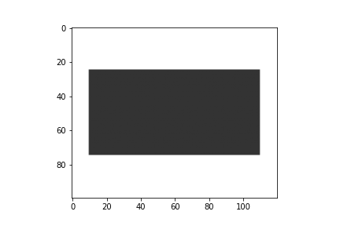

# ImageArranger
```
pip install git+https://github.com/naru-19/ImageArranger
```

# usage
## interactive_show

To display PIL images interactively.
```python
# test_ishow.ipynb
import imgarr
import numpy as np
from PIL import Image

red = np.zeros((200, 100, 3))
red[:, :, 0] = 0.5
imgs0 = [
    Image.fromarray(((red + 0.5 * i / 5) * 255).astype(np.uint8)) for i in range(5)
]
imgs1 = [
    Image.fromarray(
        ((np.zeros((100, 100, 3)) + 0.7 * (1 - i / 5)) * 255).astype(np.uint8)
    )
    for i in range(5)
]
imgs2 = [
    Image.fromarray(((np.zeros((200, 300, 3)) + 0.5 * i / 5) * 255).astype(np.uint8))
    for i in range(5)
]
ifig = imgarr.ishow([imgs0, imgs1, imgs2], setFrame=True, layout=None)

```

You can also use np.ndarray images in the same way.

- [ ] implement save method.

## concat, align
concat

```python
import imgarr
import matplotlib.pyplot as plt
import numpy as np

img0 = np.zeros((50, 100, 3)) + 0.2
img1 = np.zeros((100, 50, 3)) + 0.8

plt.imshow(imgarr.get_concat_horizontal([img0, img1], margin=10))
plt.axis("off")

```

align

```python
import imgarr
import matplotlib.pyplot as plt
import numpy as np

img0 = np.zeros((50, 100, 3)) + 0.2

plt.imshow(imgarr.align_center(img0, w=120, h=100))
plt.axis("off")

```
